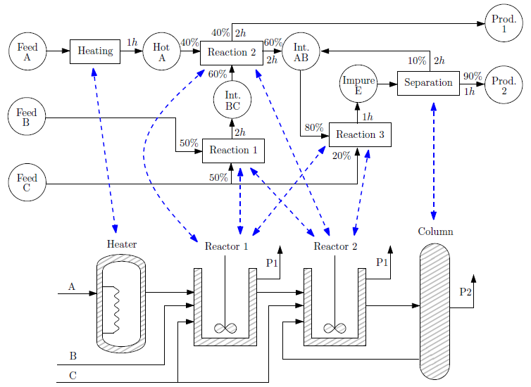
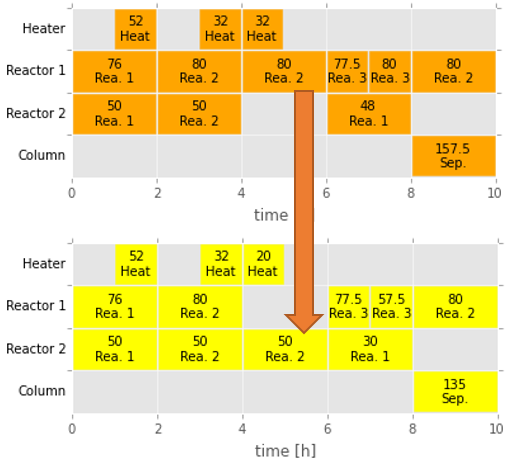

# pySTN
Implementation of a robust scheduling system based on STN (State-Task-Network) models.

## Description
This is supporting code to reproduce the results in [1].
It allows the construction of a schedule optimizer according to the model in [2], and it also
implements a robustification procedure that renders the schedules immune to uncertain events such as
unit or tasks delays and swaps.

  
  

## Usage
Please refer to [this IPython notebook](http://nbviewer.ipython.org/github/robin-vjc/pySTN/blob/master/STN%20with%20Python.ipynb).

## References
1. R. Vujanic, P. Goulart, M. Morari, *Robust Optimization of Schedules Affected by Uncertain Events*, July 2015, submitted.

2. E. Kondili, C.C. Pantelides, and R.W.H. Sargent, *A general algorithm for short-term scheduling of batch
operations - I. MILP formulation.*, Computers & Chemical Engineering 17 (1993), no. 2, 211�227.

